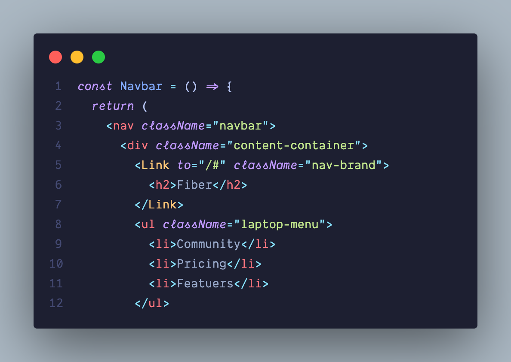

# Electronic Moonlight Theme

A beautifully muted dark theme with subtle vibrance based off [Electron Color Theme](https://marketplace.visualstudio.com/items?itemName=kuscamara.electron) and [Moonlight II Italics](https://marketplace.visualstudio.com/items?itemName=atomiks.moonlight).

## Screenshots

## Installation

1. Open Extensions sidebar panel in VS Code.
2. Search for Electronic Moonlight Theme
3. Click Install to install it.
